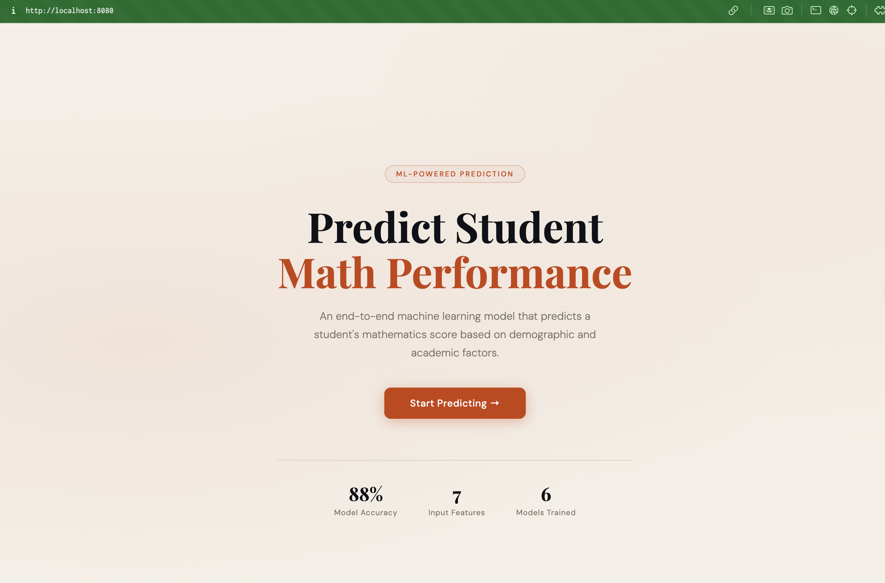
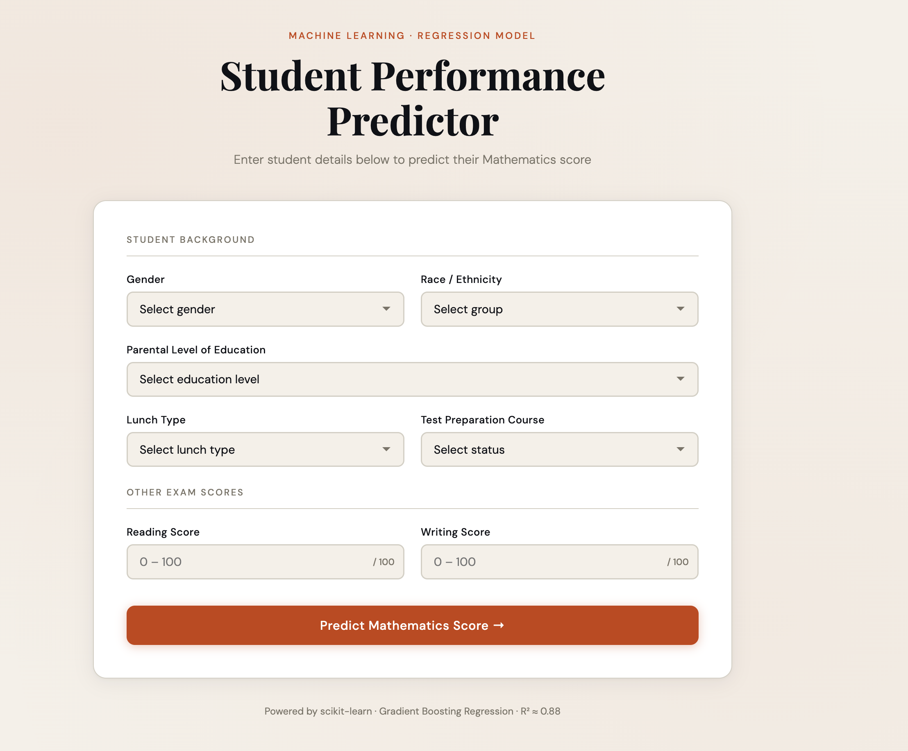
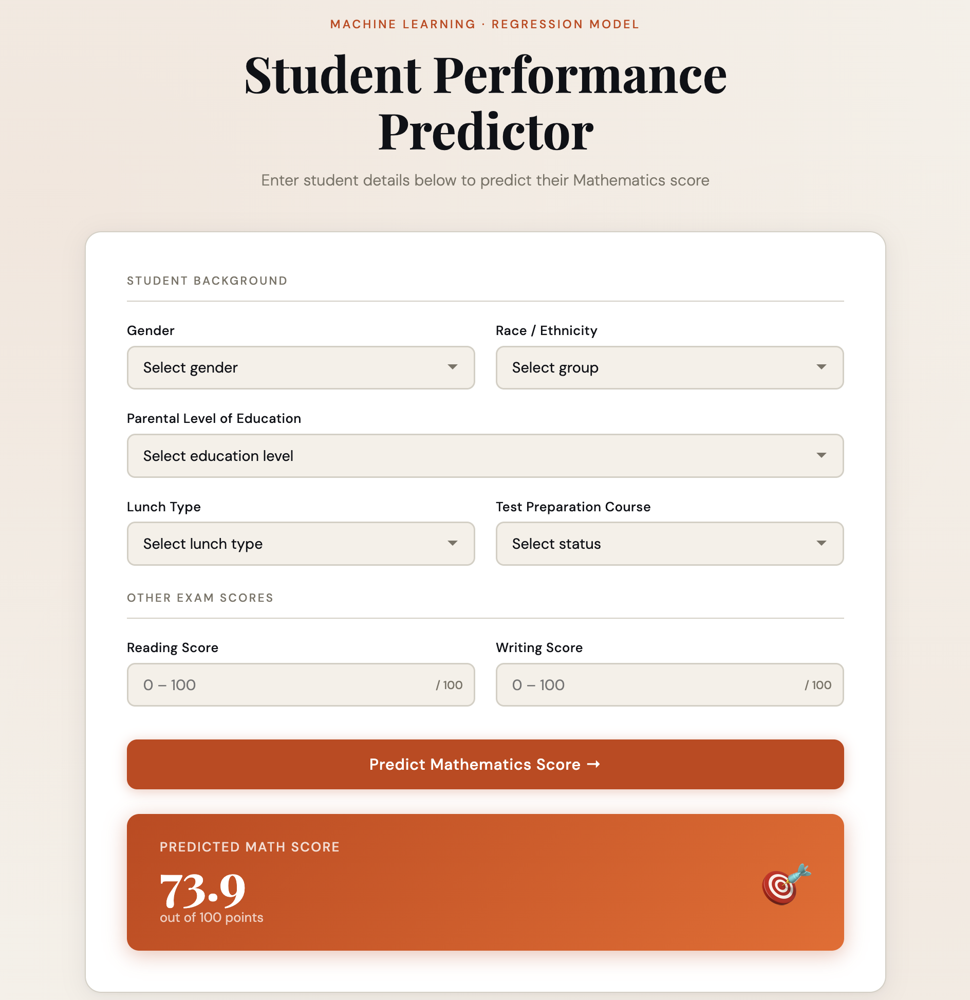

# End-to-End Machine Learning Project

> A production-ready machine learning pipeline that predicts a student's mathematics score from demographic and academic inputs — built with a modular, scalable architecture that mirrors real-world ML engineering practices.


---

## Screenshots

| Landing Page                      | Prediction Form               | Result                            |
| --------------------------------- | ----------------------------- | --------------------------------- |
|  |  |  |

---

## What This Project Does

This project takes a student's background information — gender, ethnicity, parental education level, lunch type, test preparation, reading score, and writing score — and predicts their **mathematics exam score** using a trained regression model.

But more importantly, it demonstrates **how a real ML project is structured** — from raw data exploration in a Jupyter notebook all the way to a deployed Flask web application. Every layer of the stack is modular, logged, and built to be extended.

---

## Project Architecture

```
End-to-end-ML-project/
│
├── src/                          # Core Python package
│   ├── components/               # Individual pipeline stages
│   │   ├── data_ingestion.py     # Reads CSV, splits train/test
│   │   ├── data_transformation.py# Preprocessing pipeline (scaling, encoding)
│   │   └── model_trainer.py      # Trains & evaluates multiple models
│   │
│   ├── pipeline/                 # Orchestration layer
│   │   ├── train_pipeline.py     # Chains all 3 components together
│   │   └── predict_pipeline.py   # Loads artifacts, serves predictions
│   │
│   ├── exception.py              # Custom exception with file + line info
│   ├── logger.py                 # Timestamped file logging
│   └── utils.py                  # save_object, load_object, evaluate_models
│
├── artifacts/                    # Auto-generated (gitignored in production)
│   ├── model.pkl                 # Serialized best model
│   ├── preprocessor.pkl          # Fitted ColumnTransformer
│   ├── train.csv
│   └── test.csv
│
├── notebook/                     # Exploratory work
│   ├── data/stud.csv             # Raw dataset
│   ├── 1. EDA STUDENT PERFORMANCE.ipynb
│   └── 2. MODEL TRAINING.ipynb
│
├── templates/                    # Flask HTML templates
│   ├── index.html                # Landing page
│   └── home.html                 # Prediction form + result display
│
├── app.py                        # Flask application entry point
├── setup.py                      # Package installation config
└── requirements.txt
```

---

## Data Flow

```
stud.csv
   │
   ▼
data_ingestion.py ──────────────► train.csv + test.csv
   │
   ▼
data_transformation.py ─────────► preprocessor.pkl (ColumnTransformer)
   │                               • Numerical: Imputer → StandardScaler
   │                               • Categorical: Imputer → OneHotEncoder → Scaler
   ▼
model_trainer.py ───────────────► model.pkl (best of 6 models via GridSearchCV)
   │
   ▼
predict_pipeline.py ────────────► loads both .pkl files → transforms input → predicts
   │
   ▼
app.py (Flask) ─────────────────► serves prediction via web UI
```

---

## ML Pipeline Details

### Models Evaluated

All models are trained with `GridSearchCV` for hyperparameter tuning and evaluated on R² score:

| Model             | Hyperparameters Tuned                  |
| ----------------- | -------------------------------------- |
| Linear Regression | —                                      |
| Decision Tree     | criterion                              |
| Random Forest     | n_estimators                           |
| Gradient Boosting | learning_rate, subsample, n_estimators |
| XGBoost           | learning_rate, n_estimators            |
| AdaBoost          | learning_rate, n_estimators            |

The best model is automatically selected and saved as `model.pkl`.

### Preprocessing Strategy

```python
# Numerical columns → impute missing with median → standard scale
# Categorical columns → impute missing with mode → one-hot encode → standard scale
ColumnTransformer([
    ("num_pipeline", numerical_pipeline, numerical_columns),
    ("cat_pipeline", categorical_pipeline, categorical_columns)
])
```

### Model Performance

```
Best Model : Gradient Boosting Regressor
R² Score   : ~0.88  (88% variance explained)
```

---

## Getting Started

### Prerequisites

- Python 3.8+
- Git

### Installation

```bash
# 1. Clone the repository
git clone https://github.com/varungupta04/End-to-end-ML-project.git
cd End-to-end-ML-project

# 2. Create and activate virtual environment
python -m venv venv
source venv/bin/activate        # Mac/Linux
# venv\Scripts\activate         # Windows

# 3. Install dependencies
pip install -r requirements.txt

# 4. Train the model (generates artifacts/)
python -m src.components.data_ingestion

# 5. Start the Flask app
python app.py
```

### Usage

Open your browser and navigate to:

```
http://127.0.0.1:8080/predictdata
```

Fill in the student details and click **Predict Mathematics Score**.

---

## Key Design Patterns

### 1. Custom Exception Handling

Every exception carries the **file name and line number** where it originated — making debugging dramatically faster in a multi-file project.

```python
class CustomException(Exception):
    def __init__(self, error_message, error_detail: sys):
        # Extracts precise traceback info automatically
```

### 2. Centralized Logging

All pipeline stages write timestamped logs to a dedicated `logs/` directory. Every run creates a new log file.

```python
logging.basicConfig(
    filename=LOG_FILE_PATH,
    format="[ %(asctime)s ] %(lineno)d %(name)s - %(levelname)s - %(message)s"
)
```

### 3. Artifact Serialization

Models and preprocessors are saved as `.pkl` files using `dill` — a more powerful serializer than `pickle` that handles complex sklearn objects.

```python
def save_object(file_path, obj):
    with open(file_path, "wb") as f:
        dill.dump(obj, f)
```

### 4. Dataclass for Prediction Input

Form inputs are mapped to a typed Python dataclass before being converted to a DataFrame — keeping the prediction pipeline clean and decoupled from Flask.

```python
class CustomData:
    def get_data_as_data_frame(self) -> pd.DataFrame:
        # Returns a single-row DataFrame ready for model inference
```

---

## Dataset

**Source:** [Students Performance in Exams — Kaggle](https://www.kaggle.com/datasets/spscientist/students-performance-in-exams)

| Feature                     | Type        | Values                 |
| --------------------------- | ----------- | ---------------------- |
| gender                      | Categorical | male, female           |
| race/ethnicity              | Categorical | group A–E              |
| parental level of education | Categorical | 6 levels               |
| lunch                       | Categorical | standard, free/reduced |
| test preparation course     | Categorical | none, completed        |
| reading score               | Numerical   | 0–100                  |
| writing score               | Numerical   | 0–100                  |
| **math score**              | **Target**  | **0–100**              |

---

## Tech Stack

| Layer            | Technology                              |
| ---------------- | --------------------------------------- |
| Language         | Python 3.11                             |
| Web Framework    | Flask                                   |
| ML Library       | scikit-learn, XGBoost                   |
| Data Processing  | pandas, numpy                           |
| Serialization    | dill                                    |
| Frontend         | HTML5, CSS3 (vanilla)                   |
| Deployment-ready | AWS Elastic Beanstalk (`.ebextensions`) |

---

## Using This as a Template

This project is intentionally structured as a **reusable ML project template**. To adapt it for your own regression or classification problem:

1. **Swap the dataset** — replace `notebook/data/stud.csv` with your own CSV
2. **Update `data_ingestion.py`** — point to your new data source
3. **Update `data_transformation.py`** — define your numerical and categorical columns
4. **Update `model_trainer.py`** — add or remove models as needed
5. **Update `predict_pipeline.py`** — match `CustomData` fields to your features
6. **Update `home.html`** — change form fields to match your input features

The logging, exception handling, artifact saving, and Flask serving layer all work out of the box without any changes.

---

## Acknowledgements

- Dataset by [Rohan Joseph on Kaggle](https://www.kaggle.com/datasets/spscientist/students-performance-in-exams)
- Deployment inspiration by [Krish Naik's](https://www.youtube.com/@krishnaik06) End-to-End ML course

---

## License

This project is open source and available under the [MIT License](LICENSE).
